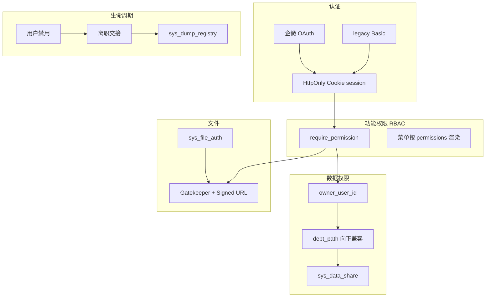

# CRM 权限管理 — 总方案（长期上下文）

> **用途**：供 Cursor / 协作者理解权限体系的**全局设计**。  
> **不用于直接执行**。任务、验收、改动清单见 `01`–`04`；横切工程任务见 [engineering-baseline.md](engineering-baseline.md)。

---

## 总目标

在 `cursor-crm`（FastAPI + SQLite 单体）落地基于 PDF「柴犬护卫队」模型的权限体系：

1. **默认拒绝（Default Deny）**：无权限则 API 403、菜单不可见。
2. **功能权限（RBAC）**：用户 → 角色 → 权限点 → API / 菜单。
3. **数据权限（行级）**：Owner + 部门向下兼容 + 显式共享。
4. **生命周期**：禁用用户、离职交接、Dump 归档与销毁。
5. **文件安全**：禁止公开 `/previews`；网关 + `sys_file_auth` + 签名 URL。
6. **渐进迁移**：保留 legacy 登录与 `owner` 字符串字段；业务表只增不删。

**范围**：本仓库 CRM + 交付子模块；权限码命名预留 RMS，首期不实现 RMS。

**登录策略**：企微 OAuth 为主（03）、本地超管兜底（02/03）；开发期允许 `admin` 全权限验证。

---

## 权限模型

### 分层



### 认证模式

| 模式 | 环境变量 | 说明 |
|------|----------|------|
| `legacy` | `CRM_AUTH_MODE=legacy` | Basic + 01 HTML 最小保护；无 RBAC/无行级 |
| `rbac` | `CRM_AUTH_MODE=rbac` | Cookie session + RBAC +（03 起）DataScope |

开发期可叠加 `CRM_ALLOW_DEFAULT_ADMIN=1`；生产禁止默认弱密码。

### 功能权限（RBAC）

- 校验：`require_permission("module.resource.action")`；菜单与 API 一致，禁止仅前端隐藏。
- `SUPER_ADMIN` / 开发 `admin`：迁移期全功能权限。

**权限码命名空间**（示例，seed 见 02）：

```text
crm.clients.* / crm.opportunities.*
delivery.roster.* / delivery.pipeline.* / delivery.handbook.*
delivery.handoff.review
system.users.manage / system.roles.manage / system.audit.read
system.dump.manage / system.dump.restore / system.dump.destroy
```

**种子角色**（02 首期；03 可扩展 `data_scope`）：

| role_code | 说明 |
|-----------|------|
| SUPER_ADMIN | 超管 |
| SALES | 销售 |
| DELIVERY | 交付 |
| VIEWER | 只读 |

### 数据权限（DataScope）

由 `DataScopeService` 统一过滤（03）；禁止 API 直接返回全表。

| 范围 | 含义 |
|------|------|
| `ALL` | 超管或授权角色 |
| `DEPT_AND_CHILD` | 本部门及子部门 |
| `SELF` | 仅自己 Owner |
| `SHARED` | 显式共享 |

**Owner 规则**：

| 实体 | owner 来源 |
|------|------------|
| Client | `owner_user_id` |
| Opportunity | 继承 Client，可单独指定 |
| Roster / Interview / Settlement | 继承 Client |
| Pipeline | `recruiter_user_id`，否则继承 Client |
| Handbook | Client owner + `uploaded_by_user_id` + ACL |

`created_by_user_id` / `updated_by_user_id` 仅审计。

### 动态共享

- `sys_data_share`、`sys_virtual_group`、`sys_group_member`
- 支持只读/可编辑；禁止二次转授；撤销立即失效

### 文件访问

1. 写入 `sys_file_auth`（含 `uploaded_by_user_id`、`acl_json`）
2. Gatekeeper：`DataScope` / 共享 / `acl_json`
3. HMAC Signed URL（TTL 60min）；过期 403
4. 禁止绕过网关读 `UPLOAD_DIR`；终态不得「仅登录可读」

### 审计

- 业务：`AuditLog`（保留）
- 特权：`sys_audit_log`（永久）

### 代码布局（目标态）

`auth/` 承载 models、permissions、file_gatekeeper（03）、sharing、handover、wecom（03）、dump（04）；`main.py` 仅注册路由。

---

## 表设计

### 系统表（`sys_*`，SQLite，只增不删）

**02 — RBAC、审计、schema 账本**

```text
schema_migrations(migration_id, applied_at)
sys_user(id, username, display_name, password_hash, status, created_at, updated_at)
sys_role(role_id, role_code, role_name, data_scope)
sys_permission(perm_id, perm_code, module, action, description)
sys_user_role(user_id, role_id)
sys_role_permission(role_id, perm_id)
sys_audit_log(...)
```

**03 — 组织、共享、文件**

```text
sys_department(dept_id, parent_id, name, dept_path, leader_user_id)
sys_user.wecom_userid
sys_data_share(...)
sys_virtual_group(...)
sys_group_member(...)
sys_file_auth(file_id, module_type, data_id, owner_user_id, storage_key,
  uploaded_by_user_id, acl_json, mime_type, created_by_user_id, created_at)
```

**04 — Dump**

```text
sys_dump_registry(dump_id, source_user_id, source_client_id, module_type, status,
  storage_path, payload_meta_json, created_by_user_id, created_at, expires_at,
  destroyed_at, destroyed_by_user_id, notes)
```

`sys_dump_registry.status`：`active` | `expired` | `destroyed`（`expires_at` 默认 +180 天）。

### 业务表扩展（03，nullable，保留旧字段）

```text
owner_user_id
created_by_user_id
updated_by_user_id
recruiter_user_id
uploaded_by_user_id
```

旧 `owner` 字符串列不删除。Owner **数据**迁移用独立脚本（`--dry-run`），与 `schema_migrations` **结构**迁移分离。

---

## 阶段边界

| 阶段 | 执行文档 | 权限域内负责 | 权限域内不负责 |
|------|----------|--------------|----------------|
| 01 | `01-security-foundation.md` | 安全底座、HTML 最小保护、鉴权文件接口 | RBAC、行级、企微、Dump |
| 02 | `02-local-rbac.md` | 本地 RBAC、`/api/me`、HTML 完整 session、`CRM_AUTH_MODE` | 行级、企微、共享、`sys_file_auth`、Dump |
| 03 | `03-data-scope-wecom-sharing.md` | DataScope、企微、共享、交接、`sys_file_auth` | Dump、OSS、迁 MySQL |
| 04 | `04-dump-lifecycle.md` | Dump 登记/恢复/销毁、特权审计 | 改 Owner 规则 |

**HTML 鉴权**：01 未登录不可进壳；02 Cookie session 与 API 同一用户，`/api/me` 与 HTML 共用 `get_current_user`；03/04 不降级。

**横切工程**（结算路径、migration ledger、pytest）：见 [engineering-baseline.md](engineering-baseline.md)，按 01/02 落点执行，不属本表「权限域」列。

**执行约定**：只执行当前阶段对应的 `01`–`04`（及该阶段引用的 engineering-baseline 条目）；**不要从本文件拆任务**。

---

## 通用约束

- 分阶段提交；不合并多阶段为一次 PR。
- 不删除 legacy 路径，除非子阶段明确要求。
- 不格式化无关文件；不改 `.cursor/plans` 归档方案。
- Default Deny；迁移期 `admin` / `SUPER_ADMIN` 可兜底。
- 文件安全优先于菜单美化。
- DB：**只增**表/列，不 DROP 旧列。
- 未匹配 `owner` 不得静默归 admin。
- 新逻辑进 `auth/`，避免 `main.py` 膨胀。
- 03 企微凭证为外部依赖；04 不阻塞 01–03。
